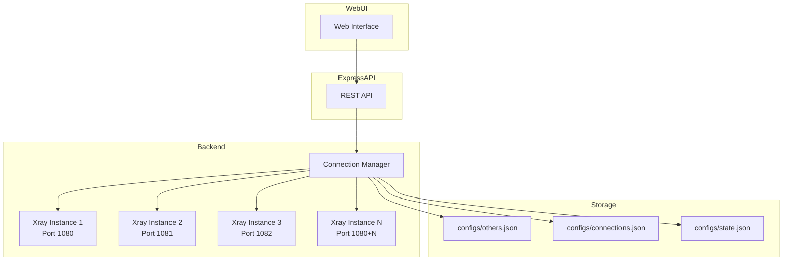
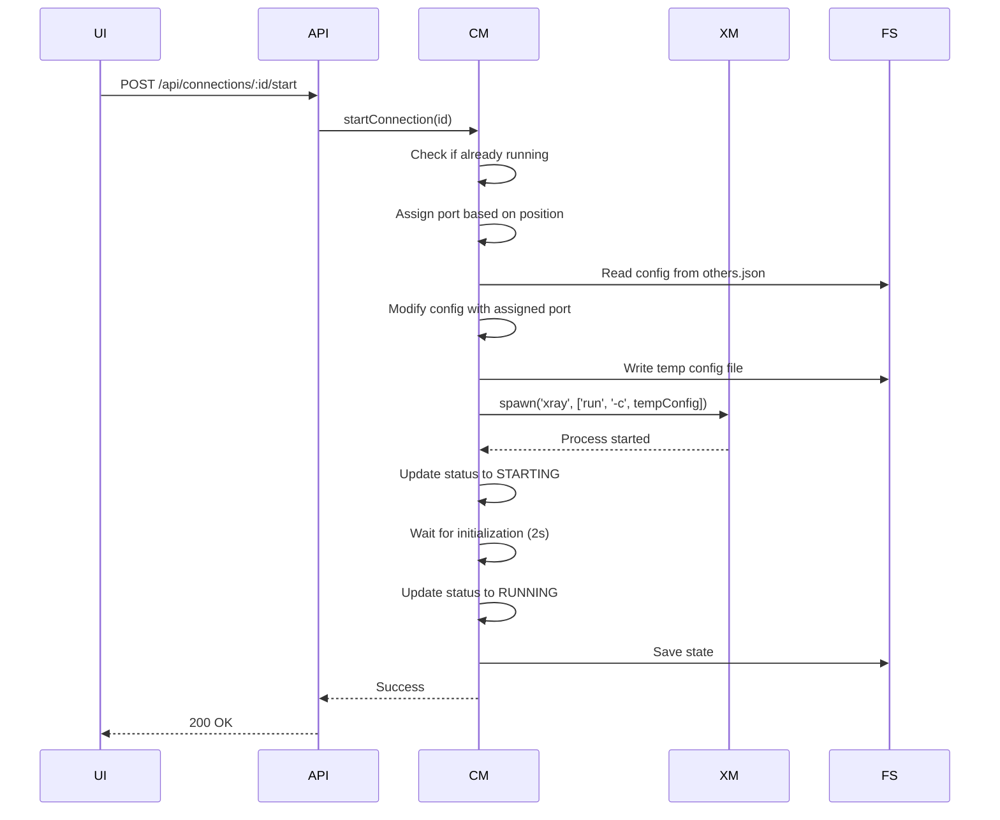
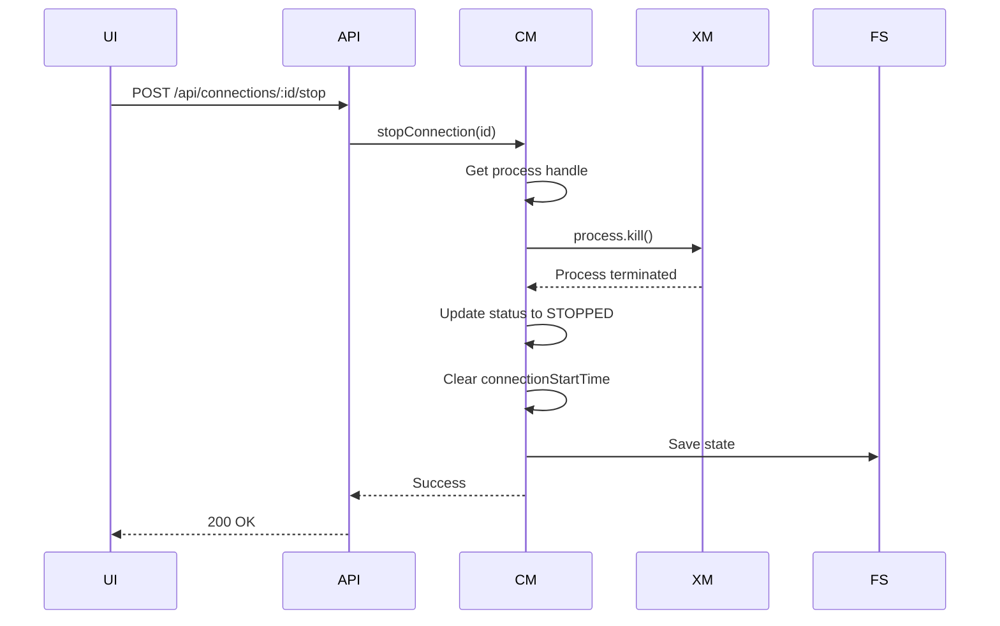

# Multi-Connection Implementation Plan

## Overview

This document outlines the implementation strategy for supporting multiple Xray configurations simultaneously. The current system only allows one active configuration at a time, running on port 1080. The new implementation will enable multiple configurations to run concurrently, each on a separate port based on their order in the connection list.

## Current Architecture Analysis

### Existing Components

1. **XrayManager** ([`src/xray-manager.ts`](src/xray-manager.ts))
   - Manages a single Xray process
   - Tracks status (Running/Stopped/Starting)
   - Handles configuration switching
   - Stores active config name and connection start time

2. **LatencyTester** ([`src/latency-tester.ts`](src/latency-tester.ts))
   - Tests configurations sequentially or in parallel
   - Uses temporary ports (starting from 10000) for testing
   - Spawns temporary Xray instances for each test

3. **SpeedTester** ([`src/speed-tester.ts`](src/speed-tester.ts))
   - Tests connection speed through the active proxy (port 1080)
   - Measures download, upload, ping, and jitter

4. **Express API** ([`src/index.ts`](src/index.ts))
   - Provides REST endpoints for configuration management
   - Handles authentication and session management
   - Serves the web UI

### Current Limitations

- Only one Xray process can run at a time
- Single active configuration on port 1080
- No mechanism to manage multiple simultaneous connections
- Configuration switching requires stopping and restarting the process

## Proposed Architecture

### Core Concepts

1. **Connection List**: An ordered list of configurations that should be running simultaneously
2. **Connection Instance**: Each configuration in the list runs as a separate Xray process
3. **Port Assignment**: Each connection instance is assigned a unique port based on its position in the list
4. **Connection Manager**: A new component to manage multiple Xray processes

### Port Assignment Strategy

```
Position 0: Port 1080 (Primary connection)
Position 1: Port 1081
Position 2: Port 1082
Position 3: Port 1083
...
Position N: Port 1080 + N
```

### System Architecture Diagram



## Implementation Details

### 1. New Data Structures

#### Connection Instance Interface

```typescript
interface ConnectionInstance {
  id: string;                    // Unique identifier (config name)
  name: string;                  // Display name
  config: any;                   // Xray configuration
  port: number;                  // Assigned port
  process: ChildProcess | null;  // Xray process handle
  status: ConnectionStatus;      // Current status
  connectionStartTime: number | null;
  error?: string;                // Last error message
}

enum ConnectionStatus {
  RUNNING = 'Running',
  STOPPED = 'Stopped',
  STARTING = 'Starting',
  ERROR = 'Error'
}
```

#### Connection List State

```typescript
interface ConnectionListState {
  connections: ConnectionInstance[];
  lastUpdated: number;
}
```

### 2. Connection Manager Component

Create a new file: [`src/connection-manager.ts`](src/connection-manager.ts)

#### Responsibilities

- Manage the connection list (add, remove, reorder)
- Start/stop individual connections
- Start/stop all connections
- Monitor connection health
- Handle port assignment
- Persist connection list state

#### Key Methods

```typescript
class ConnectionManager {
  // Connection list management
  async addConnection(name: string): Promise<void>
  async removeConnection(id: string): Promise<void>
  async reorderConnections(ids: string[]): Promise<void>
  getConnections(): ConnectionInstance[]
  
  // Individual connection control
  async startConnection(id: string): Promise<void>
  async stopConnection(id: string): Promise<void>
  async restartConnection(id: string): Promise<void>
  
  // Bulk operations
  async startAll(): Promise<void>
  async stopAll(): Promise<void>
  
  // Status monitoring
  getConnectionStatus(id: string): ConnectionStatus
  getAllStatuses(): Map<string, ConnectionStatus>
  
  // State persistence
  async saveState(): Promise<void>
  async loadState(): Promise<void>
  
  // Port management
  private assignPort(index: number): number
  private updatePorts(): Promise<void>
}
```

### 3. Modified XrayManager

The existing [`XrayManager`](src/xray-manager.ts) will be refactored to work with the ConnectionManager:

- Remove single-process management logic
- Delegate process management to ConnectionManager
- Maintain backward compatibility for existing API endpoints
- Add methods to interact with ConnectionManager

### 4. New API Endpoints

Add to [`src/index.ts`](src/index.ts):

```typescript
// Connection list management
GET    /api/connections              - Get all connections
POST   /api/connections              - Add a connection to the list
DELETE /api/connections/:id          - Remove a connection from the list
PUT    /api/connections/reorder      - Reorder connections

// Individual connection control
POST   /api/connections/:id/start    - Start a specific connection
POST   /api/connections/:id/stop     - Stop a specific connection
POST   /api/connections/:id/restart  - Restart a specific connection

// Bulk operations
POST   /api/connections/start-all   - Start all connections
POST   /api/connections/stop-all    - Stop all connections

// Status monitoring
GET    /api/connections/status      - Get status of all connections
GET    /api/connections/:id/status   - Get status of a specific connection
```

### 5. WebUI Enhancements

#### New UI Components

1. **Connection List Panel** (new tab or section)
   - Display all connections in the list
   - Show status indicators for each connection
   - Display assigned ports
   - Individual start/stop/restart buttons
   - Remove button for each connection
   - Drag-and-drop reordering support

2. **Connection Status Cards**
   - Visual status indicator (Running/Stopped/Error)
   - Connection name
   - Assigned port
   - Connection duration
   - Last error message (if any)

3. **Bulk Action Buttons**
   - Start All Connections
   - Stop All Connections

#### Modified Components

1. **Status Tab**
   - Show summary of all connections
   - Display number of active connections
   - Quick access to connection list

2. **Configs Tab**
   - Add "Add to Connections" button for each config
   - Show which configs are in the connection list

### 6. State Management

#### New Storage Files

1. **`configs/connections.json`** - Connection list state
   ```json
   {
     "connections": [
       {
         "id": "config1",
         "name": "Config 1",
         "port": 1080,
         "status": "Running",
         "connectionStartTime": 1706534400000
       },
       {
         "id": "config2",
         "name": "Config 2",
         "port": 1081,
         "status": "Stopped",
         "connectionStartTime": null
       }
     ],
     "lastUpdated": 1706534400000
   }
   ```

2. **Modified `configs/state.json`** - Global application state
   ```json
   {
     "activeConfigName": "config1",
     "connectionStartTime": 1706534400000,
     "connectionListEnabled": true
   }
   ```

### 7. Process Management

#### Starting a Connection



#### Stopping a Connection



### 8. Error Handling

#### Connection Error Scenarios

1. **Port Already in Use**
   - Detect port conflict during startup
   - Mark connection as ERROR status
   - Log error message
   - Notify user via UI

2. **Invalid Configuration**
   - Validate config before starting
   - Show error in UI
   - Prevent connection from starting

3. **Process Crash**
   - Monitor process exit events
   - Update status to ERROR
   - Log crash details
   - Optionally auto-restart (configurable)

4. **Configuration Not Found**
   - Check if config exists in others.json
   - Return 404 error
   - Show user-friendly message

### 9. Logging Enhancements

#### Connection-Specific Logging

Each connection should have its own log prefix:

```
[Connection: config1] Starting Xray on port 1080...
[Connection: config1] Xray process started
[Connection: config2] Starting Xray on port 1081...
[Connection: config2] Xray process started
```

#### Log Viewer Enhancements

- Filter logs by connection
- Color-code logs by connection
- Show connection status in log viewer

### 10. Backward Compatibility

#### Maintaining Existing Functionality

1. **Single Connection Mode**
   - Keep existing `/api/start` and `/api/stop` endpoints
   - These will operate on the first connection in the list
   - Maintain compatibility with existing UI

2. **Configuration Switching**
   - Keep `/api/switch` endpoint
   - Update to work with connection list
   - Replace first connection or add to list

3. **Latency Testing**
   - Keep existing latency testing functionality
   - Update to use connection list ports
   - Allow testing specific connections

### 11. Performance Considerations

#### Resource Management

1. **Process Limits**
   - Set maximum number of concurrent connections (configurable)
   - Default: 10 connections
   - Prevent system overload

2. **Memory Management**
   - Monitor memory usage per connection
   - Clean up resources when stopping connections
   - Implement graceful shutdown

3. **Port Range**
   - Define port range (e.g., 1080-1090)
   - Validate port availability before assignment
   - Handle port conflicts gracefully

### 12. Security Considerations

1. **Port Exposure**
   - Only bind to localhost (127.0.0.1) by default
   - Allow configuration for external binding
   - Document security implications

2. **Configuration Validation**
   - Validate all configurations before starting
   - Prevent malicious configurations
   - Sanitize configuration data

3. **Access Control**
   - Maintain existing authentication
   - Apply to all new endpoints
   - Log all connection management actions

## Implementation Steps

### Phase 1: Core Infrastructure

1. Create [`ConnectionManager`](src/connection-manager.ts) class
2. Define data structures and interfaces
3. Implement connection list storage
4. Add state persistence methods

### Phase 2: Process Management

1. Implement individual connection start/stop logic
2. Add port assignment mechanism
3. Implement process monitoring
4. Add error handling and recovery

### Phase 3: API Development

1. Add new REST endpoints
2. Implement request validation
3. Add error responses
4. Update authentication middleware

### Phase 4: WebUI Development

1. Create connection list panel
2. Add connection status cards
3. Implement drag-and-drop reordering
4. Add bulk action buttons
5. Update existing tabs for integration

### Phase 5: Testing and Refinement

1. Test single connection scenarios
2. Test multiple concurrent connections
3. Test error scenarios
4. Test state persistence
5. Performance testing
6. Security testing

### Phase 6: Documentation

1. Update API documentation
2. Create user guide
3. Add troubleshooting section
4. Document configuration options

## Migration Strategy

### Existing Users

1. **Automatic Migration**
   - On startup, check if connections.json exists
   - If not, create from existing active config
   - Preserve existing state.json

2. **Graceful Transition**
   - Keep old endpoints functional
   - Add deprecation warnings
   - Provide migration guide

### Data Migration

```typescript
async function migrateToMultiConnection(): Promise<void> {
  // Read existing state
  const state = await fs.readJson(STATE_JSON_PATH);
  
  // Create connection list from active config
  if (state.activeConfigName) {
    const configs = await xrayManager.listConfigs();
    const activeConfig = configs.find(c => c.name === state.activeConfigName);
    
    if (activeConfig) {
      const connections = [{
        id: activeConfig.name,
        name: activeConfig.name,
        config: activeConfig.config,
        port: 1080,
        status: xrayManager.getStatus(),
        connectionStartTime: state.connectionStartTime
      }];
      
      await fs.writeJson(CONNECTIONS_JSON_PATH, { connections, lastUpdated: Date.now() });
    }
  }
}
```

## Configuration Options

### Environment Variables

```bash
# Maximum number of concurrent connections
MAX_CONNECTIONS=10

# Starting port for connections
CONNECTION_START_PORT=1080

# Auto-restart on crash (true/false)
AUTO_RESTART_CONNECTIONS=false

# Connection startup timeout (ms)
CONNECTION_STARTUP_TIMEOUT=5000
```

### Application Configuration

Add to `.env.example`:

```env
# Multi-Connection Settings
MAX_CONNECTIONS=10
CONNECTION_START_PORT=1080
AUTO_RESTART_CONNECTIONS=false
CONNECTION_STARTUP_TIMEOUT=5000
```

## Testing Strategy

### Unit Tests

1. ConnectionManager methods
2. Port assignment logic
3. State persistence
4. Error handling

### Integration Tests

1. API endpoint testing
2. Multiple concurrent connections
3. Connection lifecycle management
4. State recovery after restart

### Manual Testing Checklist

- [ ] Add connection to list
- [ ] Remove connection from list
- [ ] Reorder connections
- [ ] Start single connection
- [ ] Stop single connection
- [ ] Restart single connection
- [ ] Start all connections
- [ ] Stop all connections
- [ ] Verify port assignment
- [ ] Test with invalid config
- [ ] Test with port conflict
- [ ] Test state persistence
- [ ] Test error recovery
- [ ] Test with maximum connections
- [ ] Test UI responsiveness

## Future Enhancements

1. **Connection Groups**
   - Organize connections into groups
   - Start/stop by group
   - Group-specific settings

2. **Connection Profiles**
   - Save connection list configurations
   - Switch between profiles
   - Import/export profiles

3. **Advanced Monitoring**
   - Real-time bandwidth usage per connection
   - Connection health metrics
   - Historical performance data

4. **Auto-Failover**
   - Automatically switch to backup connection
   - Health check monitoring
   - Configurable failover rules

5. **Load Balancing**
   - Distribute traffic across connections
   - Round-robin or weighted distribution
   - Connection pooling

## Conclusion

This implementation plan provides a comprehensive approach to adding multi-connection support to the Xray Auto-Connect application. The design maintains backward compatibility while introducing powerful new capabilities for managing multiple simultaneous connections.

The modular architecture allows for incremental implementation and testing, reducing risk and ensuring a stable release. The separation of concerns between the ConnectionManager, XrayManager, and API layers provides a clean, maintainable codebase.

Key benefits of this implementation:
- Support for multiple concurrent connections
- Flexible port management
- Robust error handling
- Comprehensive state persistence
- User-friendly interface
- Backward compatibility
- Extensible architecture for future enhancements
