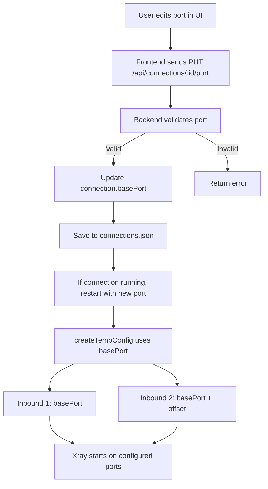

# Port Configuration Feature Plan

## Overview
Currently, connection ports are assigned based on their order in the connection list. This plan describes how to make ports user-configurable while maintaining the sorting capability.

## Current Behavior Analysis

### Backend (src/connection-manager.ts)
- **Line 82**: `port: CONNECTION_START_PORT + this.connections.length` - Port assigned based on connection index
- **Lines 368-370**: `assignPort()` method assigns ports based on index
- **Lines 372-400**: `updatePorts()` method updates all ports when connections are reordered
- **Lines 404-439**: `createTempConfig()` applies port offset to all inbounds based on connection index

### Frontend (public/script.js)
- **Lines 695-698**: Port displayed as read-only text in connection cards
- No UI for editing ports

### Key Insight
Each Xray config has multiple inbounds (e.g., HTTP on 1080, Shadowsocks on 2080). The current system:
1. Takes the original ports from the config
2. Adds an offset based on the connection's index
3. Example: Connection 0 → 1080, 2080 | Connection 1 → 1081, 2081

## Proposed Solution

### Design Model
Instead of index-based port assignment, use a **base port** model:
- Each connection has a user-configurable **base port**
- All inbounds maintain their relative offsets from the base port
- Example: If base port is 1080 and config has inbounds at 1080 and 2080:
  - Inbound 1: 1080 (base port)
  - Inbound 2: 2080 (base port + 1000 offset)

### Architecture Diagram



### Data Structure Changes

#### ConnectionInstance Interface (src/connection-manager.ts)
```typescript
export interface ConnectionInstance {
  id: string;
  name: string;
  config: any;
  basePort: number;        // NEW: User-configurable base port
  port: number;            // DEPRECATED: Kept for backward compatibility
  process: ChildProcess | null;
  status: ConnectionStatus;
  connectionStartTime: number | null;
  error?: string;
}
```

#### ConnectionListState (src/connection-manager.ts)
```typescript
export interface ConnectionListState {
  connections: Omit<ConnectionInstance, 'config' | 'process'>[];
  lastUpdated: number;
}
```

## Implementation Steps

### 1. Backend Changes (src/connection-manager.ts)

#### 1.1 Update ConnectionInstance Interface
- Add `basePort` field
- Keep `port` for backward compatibility (can be deprecated later)

#### 1.2 Modify addConnection()
```typescript
async addConnection(name: string, basePort?: number): Promise<void> {
  // ... existing validation ...

  const connection: ConnectionInstance = {
    id: name,
    name: name,
    config: configItem.config,
    basePort: basePort || CONNECTION_START_PORT,  // Use provided or default
    port: basePort || CONNECTION_START_PORT,      // For backward compatibility
    process: null,
    status: ConnectionStatus.STOPPED,
    connectionStartTime: null
  };

  this.connections.push(connection);
  await this.saveState();
}
```

#### 1.3 Add updateConnectionPort() Method
```typescript
async updateConnectionPort(id: string, newBasePort: number): Promise<void> {
  const connection = this.getConnection(id);
  if (!connection) {
    throw new Error(`Connection "${id}" not found`);
  }

  // Validate port range
  if (newBasePort < 1024 || newBasePort > 65535) {
    throw new Error('Port must be between 1024 and 65535');
  }

  // Check for port conflicts with other connections
  const portConflict = this.connections.find(c => 
    c.id !== id && c.basePort === newBasePort
  );
  if (portConflict) {
    throw new Error(`Port ${newBasePort} is already in use by "${portConflict.name}"`);
  }

  const wasRunning = connection.status === ConnectionStatus.RUNNING;

  // Stop if running
  if (wasRunning) {
    await this.stopConnection(id);
  }

  // Update port
  connection.basePort = newBasePort;
  connection.port = newBasePort;  // For backward compatibility

  await this.saveState();

  // Restart if it was running
  if (wasRunning) {
    await this.startConnection(id);
  }
}
```

#### 1.4 Modify reorderConnections()
- Remove the `await this.updatePorts()` call
- Only reorder the connections array
- Ports remain unchanged

#### 1.5 Modify createTempConfig()
```typescript
private async createTempConfig(connection: ConnectionInstance): Promise<string> {
  const tempConfig = JSON.parse(JSON.stringify(connection.config));

  if (!tempConfig.inbounds || tempConfig.inbounds.length === 0) {
    throw new Error('No inbounds found in config');
  }

  // Get the first inbound's original port to calculate offsets
  const firstInboundOriginalPort = connection.config.inbounds[0].port;
  const basePort = connection.basePort;

  // Update all inbounds' ports based on base port
  tempConfig.inbounds.forEach((inbound: any, index: number) => {
    const originalPort = connection.config.inbounds[index].port;
    const offset = originalPort - firstInboundOriginalPort;
    inbound.port = basePort + offset;
  });

  // ... rest of the method ...
}
```

#### 1.6 Remove or Deprecate updatePorts()
- This method is no longer needed since ports are user-configurable
- Can be removed or kept for migration purposes

### 2. API Endpoint Changes (src/index.ts)

#### 2.1 Add Update Port Endpoint
```typescript
// Update connection port
app.put('/api/connections/:id/port', async (req, res) => {
  const { id } = req.params;
  const { basePort } = req.body;
  
  if (typeof basePort !== 'number') {
    return res.status(400).json({ error: 'basePort must be a number' });
  }
  
  try {
    await connectionManager.updateConnectionPort(id, basePort);
    res.json({ message: `Connection "${id}" port updated to ${basePort}` });
  } catch (error: any) {
    res.status(500).json({ error: error.message });
  }
});
```

#### 2.2 Update Add Connection Endpoint
```typescript
app.post('/api/connections', async (req, res) => {
  const { name, basePort } = req.body;
  if (!name) {
    return res.status(400).json({ error: 'Name is required' });
  }
  try {
    await connectionManager.addConnection(name, basePort);
    res.json({ message: `Connection "${name}" added` });
  } catch (error: any) {
    res.status(500).json({ error: error.message });
  }
});
```

### 3. Frontend Changes (public/script.js)

#### 3.1 Modify updateConnectionsList()
Replace the read-only port display with an editable input field:

```javascript
// Inside the connection card HTML generation (around line 695-698)
<div class="connection-info-item">
    <span class="connection-info-label">Port</span>
    <div class="port-input-container">
        <input 
            type="number" 
            class="connection-port-input" 
            value="${connection.port}"
            data-connection-id="${connection.id}"
            min="1024"
            max="65535"
            ${connection.status === 'Running' ? 'disabled' : ''}
        />
        <button 
            class="port-save-btn" 
            onclick="saveConnectionPort('${connection.id}')"
            ${connection.status === 'Running' ? 'disabled' : ''}
        >Save</button>
    </div>
</div>
```

#### 3.2 Add saveConnectionPort() Function
```javascript
async function saveConnectionPort(id) {
    const input = document.querySelector(`input[data-connection-id="${id}"]`);
    const newPort = parseInt(input.value);
    
    if (isNaN(newPort) || newPort < 1024 || newPort > 65535) {
        alert('Please enter a valid port number (1024-65535)');
        return;
    }
    
    try {
        const response = await authenticatedFetch(`/api/connections/${id}/port`, {
            method: 'PUT',
            headers: { 'Content-Type': 'application/json' },
            body: JSON.stringify({ basePort: newPort })
        });
        const data = await response.json();
        if (data.error) {
            alert(data.error);
        } else {
            // Success - the list will refresh automatically
            updateConnectionsList();
        }
    } catch (error) {
        console.error('Failed to update port:', error);
        alert('Failed to update port');
    }
}
```

#### 3.3 Update addToConnections()
When adding a connection, allow specifying a port (optional):

```javascript
async function addToConnections(id) {
    const port = prompt('Enter base port (leave empty for default 1080):', '1080');
    if (port === null) return; // User cancelled
    
    const basePort = port.trim() === '' ? undefined : parseInt(port);
    if (basePort !== undefined && (isNaN(basePort) || basePort < 1024 || basePort > 65535)) {
        alert('Please enter a valid port number (1024-65535)');
        return;
    }
    
    try {
        const response = await authenticatedFetch('/api/connections', {
            method: 'POST',
            headers: { 'Content-Type': 'application/json' },
            body: JSON.stringify({ name: id, basePort })
        });
        const data = await response.json();
        if (data.error) {
            alert(data.error);
        } else {
            alert(`Config "${id}" added to connections`);
            updateConnectionsList();
        }
    } catch (error) {
        console.error('Failed to add to connections:', error);
        alert('Failed to add to connections');
    }
}
```

### 4. CSS Changes (public/style.css)

Add styling for the port input field:

```css
/* Port Input Container */
.port-input-container {
    display: flex;
    gap: 8px;
    align-items: center;
}

.connection-port-input {
    width: 80px;
    padding: 6px 8px;
    border: 1px solid var(--border-color);
    border-radius: 6px;
    font-size: 0.875rem;
    font-weight: 600;
    color: var(--text-color);
    background: var(--card-bg);
}

.connection-port-input:focus {
    outline: none;
    border-color: var(--primary-color);
}

.connection-port-input:disabled {
    background: var(--bg-color);
    color: var(--text-secondary);
    cursor: not-allowed;
}

.port-save-btn {
    padding: 6px 12px;
    font-size: 0.75rem;
    font-weight: 500;
    border-radius: 6px;
    cursor: pointer;
    background: var(--primary-color);
    color: white;
    border: 1px solid var(--primary-color);
}

.port-save-btn:hover:not(:disabled) {
    opacity: 0.85;
}

.port-save-btn:disabled {
    opacity: 0.4;
    cursor: not-allowed;
}
```

## Migration Strategy

### Existing Connections
When loading existing connections from `connections.json`:
- If `basePort` doesn't exist, use the existing `port` value
- This ensures backward compatibility

```typescript
// In loadState() method
this.connections.push({
  id: connState.id,
  name: connState.name,
  config: configItem.config,
  basePort: connState.basePort || connState.port,  // Migrate existing data
  port: connState.port,
  process: null,
  status: connState.status,
  connectionStartTime: connState.connectionStartTime,
  error: connState.error
});
```

## Testing Checklist

- [ ] Add connection with default port (1080)
- [ ] Add connection with custom port (e.g., 3000)
- [ ] Edit port of stopped connection
- [ ] Edit port of running connection (should restart)
- [ ] Try to set invalid port (< 1024 or > 65535)
- [ ] Try to set duplicate port (should show error)
- [ ] Reorder connections (ports should NOT change)
- [ ] Remove connection (other connections' ports should NOT change)
- [ ] Start/stop connection with custom port
- [ ] Verify persistence after server restart
- [ ] Verify speed test works with custom ports

## Summary of Changes

### Files to Modify
1. **src/connection-manager.ts**
   - Update `ConnectionInstance` interface
   - Modify `addConnection()` to accept optional `basePort`
   - Add `updateConnectionPort()` method
   - Modify `reorderConnections()` to NOT update ports
   - Modify `createTempConfig()` to use `basePort`
   - Update `loadState()` for migration

2. **src/index.ts**
   - Add `PUT /api/connections/:id/port` endpoint
   - Update `POST /api/connections` to accept optional `basePort`

3. **public/script.js**
   - Modify `updateConnectionsList()` to show editable port input
   - Add `saveConnectionPort()` function
   - Update `addToConnections()` to prompt for port

4. **public/style.css**
   - Add styles for `.port-input-container`
   - Add styles for `.connection-port-input`
   - Add styles for `.port-save-btn`

## Benefits
- Users have full control over connection ports
- Sorting no longer affects port assignments
- Backward compatible with existing connections
- Clear UI for port management
- Validation prevents port conflicts
